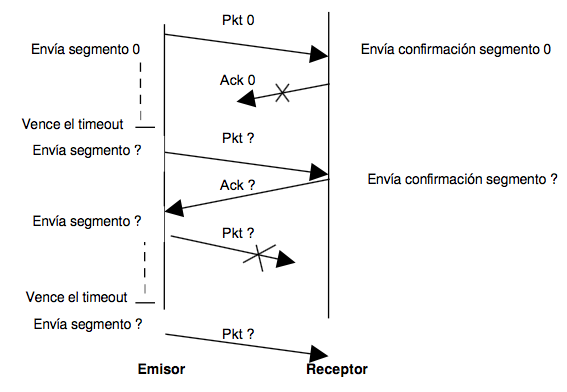

Capa de Transporte - Redes y comunicaciones ­ 2015
==================================================

1. ¿Cuál es la función de la capa de transporte?

  > Proporciona directamente servicios de comunicación a los procesos de
  > aplicación que se ejecutan en hosts diferentes. Amplía el servicio de
  > entrega de la capa de red entre dos sistemas terminales a un servicio de
  > entrega entre dos procesos de la capa de aplicación. La capa de transporte
  > entonces proporciona comunicación lógica entre procesos en distintos hosts
  > mientras que la capa de red la proporciona comunicación lógica entre hosts.

  > Es la que transporta los mensajes entre los puntos terminales de una red.

2. Describa la estructura del segmento TCP y UDP


  > La cabecera de un segmento UDP solo tiene 4 campos y cada uno de ellos
  > tiene 2 bytes:

  - puerto de origen,
  - puerto de destino,
  - longitud,
  - suma de comprobación.

  > Los números de puertos permiten dirigir el segmento al socket
  > correspondiente, es decir, el socket UDP es identificado por puerto origen
  > y puerto destino.

3. ¿Cuál es el objetivo del uso de puertos en el modelo TCP/IP?

  > La identificacion de procesos.

4. Compare TCP y UDP en cuanto a:

  1. Confiabilidad

    > Asegura la entrega de todos los paquetes enviados, permitiendo mantener
    > en el receptor el orden en que le fueron enviados (utilizando
    > confirmación de recepción, timeout, reenvío de paquetes y números de
    > secuencia) y detectar errores en la recepción (mediante checksum).

    - TCP: Si, utiliza establecimiento de conexión de 3 pasos
    - UDP: No, sin conexión, sólo ofrece el best effort de IP

  2. Multiplexación

    > Extender la comunicación host-host que ofrece IP permitiendo diferenciar
    > los procesos en el receptor y en el emisor, de modo que varios procesos
    > en un host se comuniquen con varios procesos en otros hosts, sin
    > confundir los paquetes (utilizando direcciones IP y números de puerto que
    > identifican a los procesos).

    - TCP: Socket (IP Orig, Port Orig, IP Dest, Port Dest)
    - UDP: Socket (IP Dest, Port Dest)

  3. Orientado a la conexión

    > Controlar la velocidad de transmisión del emisor para no sobrecargar la
    > red.

    TCP: SI
    UDP: NO

  4. Controles de congestión

    > Controlar la velocidad de transmisión del emisor para no sobrecargar al
    > receptor (según el tamaño de su buffer, ventana de recepción)

    TCP: SI
    UDP: NO

  5. Utilización de puertos

    > Los puertos destino y origen son utilizados tanto en TCP como en UDP por
    > fines de multiplexación/demultiplexación.UDP sólo precisa el puerto,
    > mientras que TCP tambien precisa IP origen y destino.

    - TCP: Port Origen y Port Destino
    - UDP: Port Origen y Port Destin

  6. ¿Cuál es el campo del datagrama IP y los valores que se utilizan en este
     para diferenciar que se transporta TCP o UDP? (Ayuda: buscar en
     /etc/protocols y contrastarlo con una captura de tráfico)

5. La PDU de la capa de transporte es el segmento. Sin embargo, en algunos
   contextos suele utilizarse el término Datagrama, indique cuándo. Datagrama
   => PDU de la capa de Transporte

  > Un datagrama es una cabecera + datos, tal que la cabecera ofrece la
  > información necesaria para que los datos puedan ser encaminados y alcancen
  > un destino.

  > Se suele hablar de Datagrama en referencia a los segmentos en el protocolo
  > UDP -Protocolo de Datagrama de Usuario-. Sin embargo, como datagrama es el
  > nombre formal de los PDU de la capa de Red -protocolo IP- es preferible
  > evitar esta denominación.

6. Describa el saludo de tres vías de TCP.

7. ¿Qué sucede si llega un segmento TCP a un host que no tiene a ningún proceso
   esperando en el puerto destino de dicho segmento?

  > Se retorna un response TCP con el flag RESET seteado en 1 indicando que
  > dicha conexion no debe ser utilizada.

  1. Utilice hping3 para enviar paquetes TCP al puerto destino 40 del mismo
     Live CD con el Flags ACK activado.

    ```bash
    hping3 -p 40 -A localhost
    ```

    ```bash
    #=> HPING localhost (lo 127.0.0.1): A set, 40 headers + 0 data bytes
    #=> len=40 ip=127.0.0.1 ttl=64 DF id=0 sport=40 flags=R seq=0 win=0 rtt=0.1 ms
    #=> len=40 ip=127.0.0.1 ttl=64 DF id=0 sport=40 flags=R seq=1 win=0 rtt=0.1 ms
    ```

8. ¿Qué sucede si llega un datagrama UDP a un host que no tiene a ningún
   proceso esperando en el puerto destino de dicho datagrama?

  > Se retorna un mensaje ICMP indicando el fracaso.

  1. Utilice hping3 para enviar datagramas UDP al puerto destino 40 del mismo
     Live CD.

    ```bash
    hping3 -p 40 --udp localhost
    ```

    ```bash
    #=> HPING localhost (lo 127.0.0.1): udp mode set, 28 headers + 0 data bytes
    #=> ICMP Port Unreachable from ip=127.0.0.1 name=localhost
    #=> status=0 port=1334 seq=0
    #=> ICMP Port Unreachable from ip=127.0.0.1 name=localhost
    #=> status=0 port=1335 seq=1
    ```

9. Investigue qué es multicast. ¿Sobre cuál de los protocolos de capa de
   transporte funciona? ¿Se podría adaptar para que funcione sobre el otro
   protocolo de capa de transporte? ¿por qué?

10. Utilice el comando netstat para obtener la siguiente información de su PC:

  1. Para listar las comunicaciones TCP establecidas

    `netstat -at | grep -i established`

  2. Para listar las comunicaciones UDP establecidas

    `netstat -au | grep -i established`

  3. Obtener solo los servicios TCP que están esperando comunicaciones

    `netstat -tl`

  4. Obtener solo los servicios UDP que están esperando comunicaciones

    `netstat -ul`

  5. Repetir los anteriores para visualizar el proceso del sistema asociado a
     la conexión

    > Se agrega el flag -p que especifica el proceso

11. Use CORE para armar una topología como la siguiente, sobre la cual deberá
    realizar:

  1. En Servidor, utilice la herramienta ncat para levantar un servicio que
     escuche en el puerto 8001/TCP. Utilice la opcion -k para que el servicio
     sea persistente

  2. Desde CLIENTE1 conectarse a dicho servicio utilizando también la
     herramienta ncat

  3. Inspeccionar el estado de las conexiones con el comando netstat en ambos
     equipos

    > Ayuda: watch -n 1 'netstat -nat'

  4. Cerrar la conexión desde CLIENTE1 y ver estados de las conexiones en ambos
     equipos.

  5. Intentar nuevamente realizar la conexión utilizando el mismo port origen.
     Usar opción -p de netcat
    - ¿Seria posible realizar la conexión desde CLIENTE2 utilizando dicho
        puerto origen?

  6. Volver a correr el servidor y lograr varias conexiónes desde los clientes.

  7. En base a lo observado, ¿cuántas conexiones son posibles al servidor desde
     un host?

    ```bash
    expr 65535 - $(netstat -a | wc -l) + 2 #=> 64852 en mi ordenador.
    ```

12. De acuerdo a la captura de la siguiente figura, indique los valores de los
    campos borroneados

13. Dada la sesión TCP de la figura, completar los valores marcados con un
    signo de interrogación

14. Completar los datos que faltan en el intercambio de mensajes del siguiente
    diagrama de flujo TCP:

15. Utilizando el Live CD, use Wireshark para capturar paquetes enviados y
    recibidos en cada uno de los siguientes casos. Para ello, arranque la
    captura antes de realizar los incisos A, B, C y D

    - Abra un navegador e ingrese a la URL: www.redes.unlp.edu.ar
    - Analice la secuencia de segmentos TCP que permiten la apertura del canal
        de comunicación por el cual posteriormente viajarán los mensajes HTTP
        intercambiados.
        - ¿Con que nombre se conoce a dicha secuencia?
        - ¿Qué flags se utilizan en cada uno de los segmentos intercambiados?
        - ¿Qué indica cada uno de estos flags?
    - Cierre el navegador:
      - Analice la secuencia de segmentos TCP que ocurren al hacerlo 
      - ¿Cuál es el objetivo éstos? 
      - ¿Qué flags se utilizan en cada uno de dichos segmentos? 
      - ¿Qué indica cada uno de estos flags?
    - Para este ejercicio debe usar tanto el navegador Chromium como Iceweasel.
        Utilice Chromium para ingresar a la URL: www.redes.unlp.edu.ar/ y
        seguidamente utilice Iceweasel para ingresar nuevamente a la URL:
        www.redes.unlp.edu.ar/
      - Observe la información de “Puerto Origen” y “Puerto destino” de cada
          una de las comunicaciones. En base a lo observado, responda ¿Es
          posible conectarse 2 veces en forma simultanea al mismo lugar? ¿Qué
          distingue una conexión de otra? Capture el tráfico de red si
          considera necesario para observar dicha información.
      - Identifique lo observado en el punto anterior utilizando el comando
          netstat.
    - Desde la consola de root use el servicio tftp:
      - Inicie el servicio tftp: “service tftpd-hpa start”.
      - Verifique con el comando netstat que el servicio efectivamente arranco.
      - Ejecute “tftp localhost” y copie un archivo cualquiera desde su PC al
          servidor, a través de la opción put: “put captura.pcap” por ejemplo.
      - Borre el archivo de su PC: “rm captura.pcap” y obténgalo ahora del
          servidor a través de la opción get: “get captura.pcap” por ejemplo.
    - ¿Qué diferencias encuentra en cuanto a mensajes intercambiados entre los
        puntos A, B respecto del punto D?
    - ¿Qué diferencias encuentra en el punto D respecto a los anteriores
        respecto a utilización de puertos y protocolo de transporte utilizado?

16. Investigue los distintos tipos de estado que puede tener una conexión TCP.

17. Dada la siguiente captura del comando netstat, responda:

  ```
  Active Internet connections (servers and established) 
  Proto Recv­Q Send­Q Local Address        Foreign Address      State        PID/Program name 
  tcp        0      0 163.10.10.115:53     0.0.0.0:*            LISTEN       1369/named 
  tcp        0      0 0.0.0.0:21           0.0.0.0:*            LISTEN       1719/pure­ftpd (SER 
  tcp        0      0 127.0.0.1:53         0.0.0.0:*            LISTEN       1369/named 
  tcp        0      0 0.0.0.0:22           0.0.0.0:*            LISTEN       1823/sshd 
  tcp        0      0 127.0.0.1:631        0.0.0.0:*            LISTEN       1642/cupsd 
  tcp        0      0 0.0.0.0:25           0.0.0.0:*            LISTEN       1776/master 
  tcp        0      0 127.0.0.1:953        0.0.0.0:*            LISTEN       1369/named 
  tcp        0      0 127.0.0.1:2628       0.0.0.0:*            LISTEN       1472/0 
  tcp        0      0 127.0.0.1:4038       0.0.0.0:*            LISTEN       1879/python 
  tcp        0      0 163.10.10.115:55054  200.17.202.197:443   TIME_WAIT    5076/chromium­brows 
  tcp        0      0 163.10.10.115:55055  200.17.202.197:443   ESTABLISHED  5076/chromium­brows 
  tcp        0      0 163.10.10.115:55050  200.17.202.197:443   ESTABLISHED  5076/chromium­brows 
  tcp        0      0 163.10.10.115:55051  200.17.202.197:443   ESTABLISHED  5076/chromium­brows 
  tcp        0      0 163.10.10.115:55052  200.17.202.197:443   CLOSE_WAIT   5076/chromium­brows 
  tcp        0      0 163.10.10.115:22     163.10.10.98:36595   ESTABLISHED  2977/sshd: lihuen [ 
  tcp        0      0 127.0.0.1:42170      127.0.0.1:80         ESTABLISHED  3750/firefox­bin 
  tcp        0      0 163.10.10.115:60391  173.194.42.20:80     ESTABLISHED  5076/chromium­brows 
  tcp        0      1 163.10.10.115:38029  4.5.5.5:9000         SYN_SENT     3750/firefox­bin 
  tcp        0      0 127.0.0.1:80         127.0.0.1:42170      ESTABLISHED  4229/apache2 
  ```

  1. ¿Cuántas conexiones hay establecidas?

    > 7

    ```
    tcp   0   0   163.10.10.115:55055   200.17.202.197:443   ESTABLISHED   5076/chromium­brows
    tcp   0   0   163.10.10.115:55050   200.17.202.197:443   ESTABLISHED   5076/chromium­brows
    tcp   0   0   163.10.10.115:55051   200.17.202.197:443   ESTABLISHED   5076/chromium­brows
    tcp   0   0   163.10.10.115:55052   200.17.202.197:443   CLOSE_WAIT    5076/chromium­brows
    tcp   0   0   163.10.10.115:22      163.10.10.98:36595   ESTABLISHED   2977/sshd:lihuen
    tcp   0   0   127.0.0.1:42170       127.0.0.1:80         ESTABLISHED   3750/firefox­bin
    tcp   0   0   163.10.10.115:60391   173.194.42.20:80     ESTABLISHED   5076/chromium­brows
    tcp   0   1   163.10.10.115:38029   4.5.5.5:9000         SYN_SENT      3750/firefox­bin
    tcp   0   0   127.0.0.1:80          127.0.0.1:42170      ESTABLISHED   4229/apache2
    ```

  2. ¿Cuántos puertos hay abiertos a la espera de posibles nuevas conexiones?

    > 9

    ```
    tcp   0   0   163.10.10.115:53   0.0.0.0:*   LISTEN   1369/named
    tcp   0   0   0.0.0.0:21         0.0.0.0:*   LISTEN   1719/pure­ftpd
    tcp   0   0   127.0.0.1:53       0.0.0.0:*   LISTEN   1369/named
    tcp   0   0   0.0.0.0:22         0.0.0.0:*   LISTEN   1823/sshd
    tcp   0   0   127.0.0.1:631      0.0.0.0:*   LISTEN   1642/cupsd
    tcp   0   0   0.0.0.0:25         0.0.0.0:*   LISTEN   1776/master
    tcp   0   0   127.0.0.1:953      0.0.0.0:*   LISTEN   1369/named
    tcp   0   0   127.0.0.1:2628     0.0.0.0:*   LISTEN   1472/0
    tcp   0   0   127.0.0.1:4038     0.0.0.0:*   LISTEN   1879/python
    ```

  3. El cliente y el servidor de las comunicaciones HTTP (puerto 80), ¿residen
     en la misma máquina?

    > En estas conexiones si.

    ```
    tcp   0   0   127.0.0.1:42170   127.0.0.1:80      ESTABLISHED   3750/firefox­bin
    tcp   0   0   127.0.0.1:80      127.0.0.1:42170   ESTABLISHED   4229/apache2
    ```

    > En esta no.

    ```
    tcp  0  0  163.10.10.115:60391  173.194.42.20:80  ESTABLISHED  5076/chromium­brows
    ```

  4. El cliente y el servidor de la comunicación SSH (puerto 22), ¿residen en
     la misma máquina?

    > No. uno esta en la ip `163.10.10.115` y el otro en la `163.10.10.98`

    ```
    tcp  0  0  163.10.10.115:22  163.10.10.98:36595  ESTABLISHED  2977/sshd:  lihuen
    ```

  5. Liste los nombres de todos los procesos asociados con cada comunicación.
     Indique para cada uno si se trata de un proceso cliente o uno servidor

    Proceso        | Cliente | Servidor
    ---------------|---------|---------
    chromium­brows | si      | no
    sshd           | no      | si
    firefox­bin    | si      | no
    apache2        | no      | si

    **lo sacamos en base al nro de puerto??**

  6. ¿Cuáles conexiones tuvieron el cierre iniciado por el host local y cuáles
     por el remoto?

  > Cierre iniciado por el host local:

  ```
  tcp  0  0  163.10.10.115:55054  200.17.202.197:443  TIME_WAIT  5076/chromium­brows
  ```

  > Cierre iniciado por el host remoto:

  ```
  tcp  0  0  163.10.10.115:55052  200.17.202.197:443  CLOSE_WAIT  5076/chromium­brows
  ```

  7. ¿Cuántas conexiones están aún pendientes por establecerse?

  ```
  tcp  0  1  163.10.10.115:38029  4.5.5.5:9000  SYN_SENT  3750/firefox­bin
  ```

18. ¿Cual es el puerto por defecto que se utiliza en los siguientes servicios?

  Servicio   | Puerto
  -----------|-------
  Web        | 80
  SSH        | 22
  DNS        | 53
  Web Seguro | 443
  POP3       | 110
  IMAP       | 143
  SMTP       | 25

  - Investigue en que lugar en Linux y en Windows está descripta la asociación
    utilizada por defecto para cada servicio.

    > En linux esta en `/etc/services`

19. Complete los (?) de la siguiente secuencia Stop and Wait:

  

20. Explique la lógica de Go Back – N

  > Un protocolo Go Back - N (GNB) es un protocolo ARQ con pipelining (es
  > decir, soporta múltiples segmentos en tránsito pendientes de confirmación,
  > implementando buffers en el emisor; el rango de los números de secuencia
  > debe aumentarse), por esto el emisor puede transmitir varios paquetes sin
  > esperar ningún reconocimiento, pero tiene restringido el número máximo, N,
  > de paquetes no reconocidos en el entubado, llamado ventana del emisor. El
  > emisor también tiene un timer para controlar el timeout. La recepción del
  > ACK de un segmento, confirma a todos los anteriores pendientes -acuse de
  > recibo acumulado-. El vencimiento del timer para un segmento implica la
  > retransmisión de todos los segmentos siguientes en la ventana. La ventana
  > se desplaza a medida que se reciben ACK's. El receptor envía el ACK sólo
  > del segmento recibido correctamente de mayor número de secuencia en orden
  > -es decir, que no le falte ninguno-. Puede generar acuses duplicados. No
  > precisa buffers, ya que descarta los segmentos fuera de orden y duplicados
  > (al descartar re envía el ACK del mayor número de secuencia que recibió).


21. Suponiendo Go Back N; tamaño de ventana 4 y sabiendo que E indica que el
    mensaje llegó con errores y que D significa que el mensaje será descartado
    por llegar fuera de secuencia.

    Indique en el siguiente gráfico, la numeración de los ACK que el host B envía
    al Host A.

22. Suponiendo Selective Repeat; tamaño de ventana 4 y sabiendo que E indica
    que el mensaje llegó con errores. Indique en el siguiente gráfico, la
    numeración de los ACK que el host B envía al Host A.

23. ¿Qué restricción existe sobre el tamaño de ventanas en el protocolo
    Selective Repeat?

24. Investigue cómo funciona el protocolo de aplicación FTP teniendo en cuenta
    las diferencias en su funcionamiento cuando se utiliza el modo activo de
    cuando se utiliza el modo pasivo ¿En qué se diferencian estos tipos de
    comunicaciones del resto de los protocolos de aplicación vistos?

25. Utilizando el Live CD conéctese al servidor ftp utilizando el comando ftp
    ftp.redes.unlp.edu.ar utilizando los siguientes datos:

  - Nombre de usuario: lihuen
  - Password: lihuen
  - Pruebe la transferencia de un archivo cualquiera hacia y desde el servidor.
  - Utilice Wireshark para obtener capturas de transferencias de archivos
      usando primero el modo activo y luego el modo pasivo.

******************************************************************************

Glosario
--------

Best Effort Delivery:

  > El mecanismo de mejor esfuerzo o entrega de mejor esfuerzo (Best-effort
  > delivery, en inglés) designa un tipo de servicio de red en el que la red no
  > puede garantizar que los datos lleguen a su destino, ni ofrecer al usuario
  > una determinada calidad de servicio (QoS) en sus comunicaciones.

  > En una red de «mejor esfuerzo» (best-effort network) todos los usuarios
  > reciben el mejor servicio posible en ese momento, lo que significa que
  > obtendrán distintos anchos de banda y tiempos de respuesta en función del
  > volumen de tráfico en la red.

ARQ (Automatic Repeat Request ):

  > Los protocolos ARQ son protocolos utilizados para el control de errores en
  > la transmisión de datos, garantizando la integridad de los mismos.

