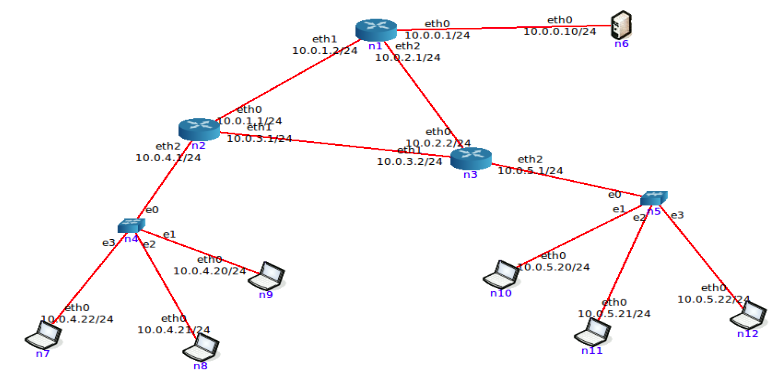

Capa de Red - Redes y comunicaciones – 2015
===========================================

1. ¿Qué servicios presta la capa de red? ¿Cuál es la PDU en esta capa? ¿Qué
   dispositivo es considerado sólo de la capa de red?

2. En las redes IP el ruteo puede configurarse en forma estática o en forma
   dinámica. Indique ventajas y desventajas de cada método.

3. Una máquina conectada a una red pero no a Internet, ¿tiene tabla de ruteo?

4. ¿Cuántas redes clase A, B y C hay? ¿Cuántos hosts como máximo pueden tener
   cada una?

5. ¿Qué son las subredes? ¿Por qué es importante siempre especificar la máscara
   de subred asociada?

6. Dado el siguiente gráfico complete:

  1. Con los datos dados, determine en cada segmento:

    * Clase de la dirección de Red [A|B|C] y máscara por defecto
    * Dirección de Subred y máscara
    * Dirección de broadcast de la subred
    * Cantidad de direcciones utilizables en la subred dada

  2. Escoja una dirección IP adecuada para cada una de las interfaces de cada
     uno de los routers.
  3. Escoja una dirección IP adecuada para cada host que no tenga.
  4. Defina la tabla de ruteo para cada router del gráfico, de forma tal de que
     todos los dispositivos en la red puedan comunicarse entre si.
  5. Defina la tabla de ruteo para algún host de la topología.

7. Para cada una de las siguientes direcciones IP (172.16.58.223/26,
   163.10.5.49/27, 128.10.1.0/23, 10.1.0.0/24, 8.40.11.179/12) determine:

  1. De qué clase de red es la dirección dada (Clase A, B o C).
  2. Cuál es la dirección de subred.
  3. Cuál es la cantidad máxima de hosts que pueden estar en esa subred.
  4. Cuál es la dirección de broadcast de esa subred.
  5. Cuál es el rango de direcciones IP válidas dentro de la subred.

8. Si usted estuviese a cargo de la administración del bloque IP 65.0.0.0/8

  1. ¿Qué máscara utilizaría si necesita definir al menos 934 subredes?
  2. Indique la dirección de la primer subred, rango de direcciones asignables
     y broadcast de la red
  3. Indique la dirección de la subred numero 817, rango de direcciones
     asignables y broadcast de la red

9. Si usted estuviese a cargo de la administración del bloque IP
   195.200.45.0/24

  1. ¿Qué máscara utilizaría si necesita definir al menos 9 subredes?
  2. Indique la dirección de subred de las primeras 9 subredes
  3. Seleccione una e indique dirección de broadcast y rango de direcciones
     asignables en esa subred

10. Describa qué es y para qué sirve el protocolo ICMP.

  1. Analice como funciona el comando ping
    - Indique el tipo y código ICMP que usa el ping.
    - Indique el tipo y código ICMP que usa la respuesta de un ping.
  2. Analice como funciona el comando traceroute (tracert en Windows) y como
     manipula el campo TTL de los paquetes IP
    - Indique el tipo y código ICMP del cuál se vale el comando traceroute para
      funcionar.

  > Utilizar una topologia de core para verificar el funcionamiento de estas
  > herramientas

11. ¿Para que se usa el bloque 127.0.0.0/8? ¿Qué PC responde a los siguientes
    comandos?:

  ```bash
  ping 127.0.0.1
  ping 127.0.54.43
  ```

12. Utilizando el LiveCD provisto por la cátedra, se configurará ruteo estático
    en la red que se muestra en el siguiente gráfico:

  

  1. Inicie la herramienta CORE y abra el archivo
     [1-ruteo-estatico.imn](src/p4/1-ruteo-estatico.imn)
  2. Inicie la virtualización de la topología.
  3. Configure cada uno de los equipos considerando:

    1. Para entrar a configurar cada equipo (PC o router) debe hacer doble
        click sobre el mismo, lo cual abre una termine de comandos.
    2. Utilice el comando ifconfig para configurar las direcciones IP delas
        interfaces según el gráfico. Por ejemplo,

      - en la PC n6 debe configurar la interfaz eth0 con la IP 10.0.0.10,
      - en el Router n1 debe configurar la eth0 con la IP 10.0.0.1, la eth1 con
        la IP 10.0.1.2 y la eth2 con la 10.0.2.1

    3. Compruebe conectividad utilizando el comando ping
    4. Utilice el comando route para configurar una ruta por defecto en todas
       las Pcs
    5. Utilice el comando route para configurar en los routers rutas estáticas,
       considerando:

      1. Router n1 envía todo el tráfico desconocido a Router n2
      2. Router n2 envía todo el tráfico desconocido a Router n3
      3. Router n3 envía todo el tráfico desconocido a Router n1

    6. Función de ruteo: Un router o una PC puede configurarse para rutear
       paquetes entre sus placas de red. Lo deseable es que el router tenga
       esto activado.

      1. Verificar `IP_FORWARD`, en los routers y las PCs, opteniendo la
         configuración con:

        ```bash
        cat /proc/sys/net/ipv4/ip_forward
        ```

        El valor 0 indica funcionalidad desactivada. 1 indica que está habilitado
        Para cambiar el valor (por ej. activar el forwarding):

        ```bash
        echo 1 > /proc/sys/net/ipv4/ip_forward
        ```

      2. Verificar `RP_FILTER`. Este parámetro, por seguridad, evita la
         recepción de paquetes por una interfaz que vengan de una IP de una red
         que el router no rutearía a través de esa interfaz. Este valor debe
         deshabilitarse en caso que el enrutamiento circular propuesto cause
         problemas.

        Para obtener el valor:

        ```bash
        cat /proc/sys/net/ipv4/conf/all/rp_filter
        ```

        El valor en 0 deshabilita su funcionalidad. Un 1 lo habilita.
        Para cambiar el valor:

        ```bash
        echo 0 >/proc/sys/net/ipv4/conf/all/rp_filter
        ```

  4. Verifique conectividad entre las PCs, utilizando los comandos `ping`,
     `traceroute` y `ping -nR`

    * Mientras realiza ping desde una PC, capture paquetes en un router
        intermedio y verifique qué paquetes pasan por la interfaz. Por ejemplo,
        mientras una PC hace ping a otra, analice los paquetes que se
        visualizan en eth0 y en eth1 de algún router por el que parte o todo el
        tráfico pasa. La captura de paquetes puede hacerse con el comando
        tcpdump -i interfaz tcpdump -i eth0

    > Alternativamente, boton derecho sobre el router o host → tcpdump →
    > <interface de red>

  5. Relevamiento: Utilizando el comando "route -n" o "netstat -nr" releve la
     configuración de las tablas de rutas tanto de los routers como de las PCs
     completando para cada dispositivo una tabla como la siguiente:

    Red Destino | Gateway | Mascara de red | Interface
    ------------|---------|----------------|----------

    * Si la estación PC n7 le envía un ping a la estación PC n6:
      1. ¿Cúal es el camino por el que viaja el requerimiento?
      2. ¿Cúal es el camino por el que viaja la respuesta?

  6. Mantenimiento de red - Suponiendo que en el Router n1 se agregó una
     interfaz de red con la dirección IP 163.10.10.1/24:

    1. Identifique los cambios que serían necesarios aplicar al ruteo estático
       para que todas las PCs puedan comunicarse con hosts en la nueva red.
    2. En base a lo anterior, ¿qué puede decir respecto del mantenimiento del
       ruteo en una red que tiene mas de 20 routers?

  7. ICMP y RUTEO 1: Desde la PC n6, realice un ping a la dirección IP 5.5.5.5

    * ¿Qué indica el mensaje de error recibido?, ¿Quién lo envía?

  8. ICMP y RUTEO 2: Desde la PC n6, realice un ping a la dirección IP
     10.0.5.23

    * ¿Qué indica el mensaje de error recibido?, ¿Quién lo envía?

  9. ICMP y RUTEO 3: Provoque un loop de enrutamiento entre los routers con una
     nueva red, por ejemplo la red 200.100.11.0/24 y luego desde la PC n6,
     realice un ping a la dirección 200.100.11.5

    * ¿Qué indica el mensaje de error recibido?, ¿Quién lo envía?

13. Utilizando el LiveCD provisto por la cátedra, se simulará una red similar a
    la anterior con enrutamiento dinámico, primero RIP y luego OSPF. Para ello
    utilice los siguientes archivos:


  * [2-ruteo-RIP.imn](src/p4/2-ruteo-RIP.imn) para realizar los ejercicios en una
  red RIP
  * [3-ruteo-OSPF.imn](src/p4/3-ruteo-OSPF.imn) para realizar los ejercicios en
  una red OSPF

  1. Inicie la virtualización de la topología.
  2. Espere a que la red converja. Luego, verifique conectividad entre las PCs
     con los siguientes comandos:

    * Utilizando el comando `ping`
    * Utilizando el comando `traceroute`
    * Utilizando el comando `ping -nR`

  3. Relevamiento: Utilizando el comando "route -n" o "netstat -nr" releve la
     configuración de las tablas de rutas tanto de los routers como de las PCs
     completando para cada dispositivo una tabla como la siguiente:

    Red Destino | Gateway | Mascara de red | Interface
    ------------|---------|----------------|----------

    Si la estación PC n6 le envía un ping a la estación PC n7:

      * ¿Cuál es el camino por el que viaja el requerimiento?
      * ¿Cuál es el camino por el que viaja la respuesta?

  4. Mantenimiento: Dada las rutas obtenidas en el punto anterior, daremos de
     baja uno de los enlaces para verificar el funcionamiento del ruteo
     dinámico. Para ello, debe utilizar el comando `ifconfig INTERFACE down`
     sobre alguna de las interfaces usada entre dos routers

    * Verifique el correcto funcionamiento luego de que la red converja.

14. ¿Qué es Ipv6? Enumere diferencias existentes en el formato de datagramas
    respecto de IPv4

15. Utilizando el LiveCD abrir la topología 3-ruteo-OSPF.imn para realizar las
    siguientes pruebas:

  * Habilitar la vista de las direcciones IPv6 en la topología (View → show →
      IPv6 Addresses)
  * Esperar a que la red converja. Verificar mediante ping entre n7 y n6
  * Observar la configuración IPv6:
    1. De la PC n7 (comando ifconfig)
    2. De la PC n6 (comando ifconfig)
    3. Del router n1 (comando ifconfig)
    4. La tabla de rutas tanto de las PC como de los routers (comando `route
       --inet6 -n`)
  * Responda:
    1. I. ¿Cuántas direcciones IPv6 se observan tanto en la PC n7 como en la PC
       n6?
    2. ¿Es posible desde la PC n7 hacer un ping6 a cada una de las direcciones
       IPv6 de la PC n6? ¿porque?
    3. En determinadas circunstancias, es necesario especificar en el comando
       ping6 la interfaz que se quiere utilizar (`ping6 -I eth0 <IPv6>`) ¿porque?
  * Capture tráfico IPv6 con el objeto de comparar el comparar con lo visto anteriormente.

16. Con el LiveCD con acceso a Internet realice las siguientes observaciones
    respecto de la autoconfiguración IP via DHCP:

    1. Inicie una captura de trafico wireshark utilizando el filtro bootp para
       visualizar unicamente tráfico de DHCP.
    2. En una terminal de root, ejecute el comando `dhclient eth0` y analice el
       intercambio de paquetes capturado.
    3. Analice la información registrada en el archivo
       `/var/lib/dhcp/dhclient.leases` ¿cuál parece su función?
    4. Ejecute el siguiente comando para eliminar información temporal asignada
       por el servidor DHCP `rm /var/lib/dhcp/dhclient.leases`
    5. En una terminal de root, vuelva a ejecutar el comando `dhclient eth0` y
       analice el intercambio de paquetes capturado nuevamente ¿a que se debió
       la diferencia con lo observado en el punto "b"?
    6. Tanto en "2" como en "5" ¿qué información es brindada al host que
       realiza la petición DHCP además de la dirección IP que tiene que
       utilizar?

17. ¿Qué es NAT y para qué sirve? De un ejemplo de su uso y analice cómo
    funcionaría en ese entorno.

  > Ayuda: analizar el servicio de Internet hogareño en el cual varios
  > dispositivos usan Internet simultáneamente.

18. ¿Qué especifica la RFC 1918 y cómo se relaciona con NAT?

19. ¿Que es CIDR (Class Interdomain routing)? ¿Por qué resulta útil?

20. Dado un router "A" que tiene las siguientes entradas en su tabla de rutas.

  Red Destino  | Gateway     | Mascara       | Interface
  -------------|-------------|---------------|----------
  202.58.128.0 | 170.10.11.1 | 255.255.255.0 | eth0
  202.58.129.0 | 170.10.11.1 | 255.255.255.0 | eth0
  202.58.130.0 | 170.10.11.1 | 255.255.255.0 | eth0
  202.58.131.0 | 170.10.11.1 | 255.255.255.0 | eth0

  Realizar la máxima agregación CIDR posible del siguiente conjunto de 4 redes
  clase C para reducir la cantidad de entradas de la tabla de enrutamiento lo
  maximo posible (Nota: la agregación no debería incluir rutas que no están
  listadas)

21. Listar las redes involucradas en los siguientes bloques CIDR:

  1. 200.56.168.0/21
  2. 195.24.0.0/13 o 195.24/13

22. El bloque CIDR 128.0.0.0/2 o 128/2, ¿Equivale a listar todas las
    direcciones de red de clase B?

  * ¿Cuál sería el bloque CIDR que agrupa todas las redes de clase A?

23. Arme una topología usando la herramienta core y evalúe los tiempos de
    convergencia con un algoritmo de cada tipo (estado de enlace y vector
    distancia). Tenga en cuenta:

    - La topología debe contener al menos 10 routers, con caminos alternativos
        entre un origen y un destino dados.
    - Mida el tiempo que tarda la topología en converger en un estado inicial.

    - Mida el tiempo que tarda la topología en converger luego de la baja de
        algún enlace usado para las comunicaciones entre el origen y destino
        seleccionados.

    > Nota: Por defecto, al armar una topología, los routers utilizan el
    > protocolo de enrutamiento OSPF. Para armar una topología con routers que
    > usen RIP, con la topología parada, deberá ingresar individualmente a la
    > configuración de cada router para des seleccionar el protocolo OSPFv2 y
    > OSPFv3 y seleccionar RIP antes de iniciarla.

24. Los algoritmos de ruteo dinámico se dividen en estado enlace y vector
    distancia. Dado el siguiente cuadro compare:

    Vector            | ¿Cada router conoce la topología completa? | ¿Converge rápidamente? | Protocolos que lo implementan
    ------------------|--------------------------------------------|------------------------|------------------------------
     Vector distancia |
     Estado de enlace |

25. ¿Qué son los sistemas autónomos? ¿Qué es necesario para que los distintos
    sistemas autónomos puedan rutear tráfico entre hosts que pertenecen a
    diferentes sistemas autónomos?

26. Los algoritmos de ruteo también se pueden clasificar como IGP y EGP. Dado
    el siguiente cuadro complete:

    ¿Implementaciones más conocidas?  | ¿Donde se usan?(dentro de un sistema autónomo/entre sistemas autónomos)   | ¿Pueden ser sustituidos por configuración manual?(Si, Depende, No) ¿Por qué?
    --------------------------------- | ------------------------------------------------------------------------- | -----------------------------------------------------------------------------
                                IGP   |
                                EGP   |


27. A partir del siguiente gráfico indique:

  - Red de la UNLP
  - Red del proveedor de Internet de la UNLP y de ARBA
  - Red de ARBA
  - ¿Qué tipo de algoritmo se utiliza para compartir información entre los
    routers 4 y 7?
  - ¿Qué tipo de algoritmo se utiliza para compartir información entre los
    routers 1 y 4?
  - ¿Qué tipo de algoritmos alimentan las tablas de ruteo de los routers 3 y 10?
  - ¿Qué tipo de algoritmos alimentan las tablas de ruteo de los routers 1 y 4?
